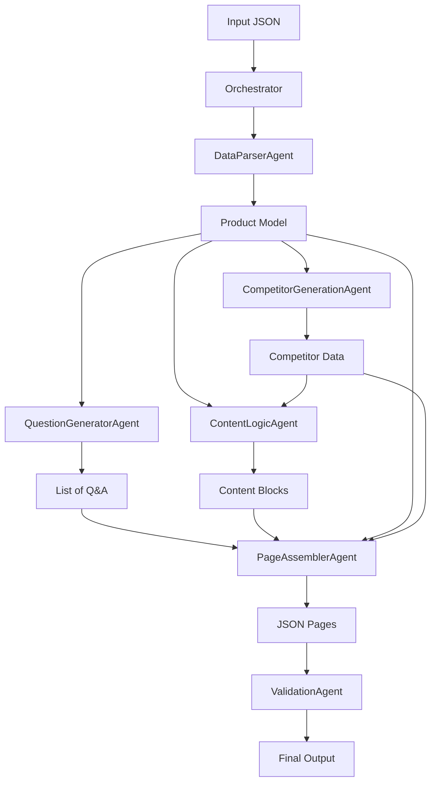

# Project Documentation

## Problem Statement
The challenge is to design and implement a modular, agentic automation system that takes a small, structured product dataset and automatically generates three distinct, machine-readable content pages: an FAQ page, a Product Description page, and a Comparison page. The system must use a multi-agent architecture, reusable content logic blocks, and a custom template engine, avoiding monolithic scripts or simple "GPT wrappers".

## Solution Overview
The solution is a Python-based multi-agent system structured around a central **Orchestrator** that manages the data flow between specialized agents.

### Key Components:
1.  **Orchestrator**: The central controller that manages the lifecycle of the content generation process. It initializes agents, passes data between them, and handles final output persistence.
2.  **Agents**:
    *   **DataParserAgent**: Responsible for ingesting raw JSON data, normalizing keys, and validating that essential fields exist. It produces a clean `Product` model.
    *   **QuestionGeneratorAgent**: Uses rule-based templates to generate a set of categorized questions and answers based on the product attributes.
    *   **CompetitorGenerationAgent**: Generates a fictional competitor product for comparison purposes.
    *   **ContentLogicAgent**: A specialized agent that handles "creative" logic. It writes the product description, formats the benefits list, and determines the comparison verdict using both product and competitor data.
    *   **PageAssemblerAgent**: The final agent in the pipeline. It takes the structured data from previous agents and applies it to defined templates using the **TemplateEngine**.
    *   **ValidationAgent**: Ensures the final output pages meet all structural and content requirements before saving.
3.  **TemplateEngine**: A lightweight, custom-built engine that performs variable substitution in JSON templates. It supports nested object access (e.g., `{{ product.name }}`).
4.  **Data Model**: A `Product` dataclass ensures type safety and clear structure for product data throughout the system.

## Scopes & Assumptions
*   **Input Data**: Assumed to be a JSON file with specific keys (Product Name, Price, etc.). The parser handles basic normalization (snake_case conversion).
*   **Pure Python**: The system runs entirely on standard Python libraries without external AI APIs.
*   **Output Format**: All outputs are strict JSON files as required.
*   **Complexity**: The template engine is kept simple (variable substitution) as per the assignment scope.

## System Design

### Architecture Diagram (Conceptual)

### Data Flow
1.  **Ingestion**: `main.py` triggers the `Orchestrator` with the path to `input_product.json`.
2.  **Parsing**: `DataParserAgent` reads the file, checks for "Product Name", "Price", etc., and returns a `Product` object.
3.  **Generation**:
    *   `QuestionGeneratorAgent` is called with the product model. It generates 15+ questions in specific categories.
    *   `CompetitorGenerationAgent` creates a fictional competitor product.
    *   `ContentLogicAgent` is called with both product and competitor data. It generates the description, formats benefits, and creates the comparison verdict.
4.  **Assembly**: `PageAssemblerAgent` loads the templates and injects the data from the previous steps.
5.  **Validation**: `ValidationAgent` checks the generated pages for completeness and correctness.
6.  **Output**: The `Orchestrator` saves the resulting dictionaries as `.json` files in the `output/` directory.

### Agent Boundaries
*   **DataParserAgent**: Pure logic. Focus on data integrity and model creation.
*   **QuestionGeneratorAgent**: Template-based generation. Focus on categorization.
*   **CompetitorGenerationAgent**: Rule-based generation. Focus on creating comparison targets.
*   **ContentLogicAgent**: Logic-heavy. Focus on synthesizing data into readable content.
*   **PageAssemblerAgent**: Pure logic. Focus on structure and formatting.
*   **ValidationAgent**: Quality assurance. Focus on contract enforcement.
